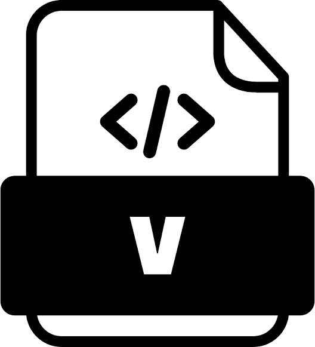

# Hi, I'm Ivy 👋

🏫 **Master of Science (M.S.) in Electrical Engineering**  
National Cheng Kung University (NCKU), Tainan, Taiwan

🎓 **Bachelor of Science (B.S.) in Interdisciplinary Program of Science (2026)**  
National Tsing Hua University (NTHU), Hsinchu, Taiwan

## 👨‍💻 About Me

- My name is Pei-Lin, Chiang. You can call me Ivy.
- 🔭 Interested in **AI Systems, Operating Systems, Embedded Systems, Compiler Design, and Hardware Design**
- 🌱 Currently exploring **LLM Applications, Multi-Agent Systems, and Linux Kernel**
- 💻 Mainly coding in **C/C++, Python, and TypeScript**
- 📫 Reach me at **ivylingchiang@gmail.com**

## 💻 Tech Stack

**Languages**

<code></code>

<code></code>

<code></code>

<code></code>

<code></code>
  

**Tools & Platforms**

<code></code>

<code></code>

<code></code>

---

## 🚀 Featured Projects

| Project | Description | Tech / Focus |
|---|---|---|
| [MAXi](https://github.com/ivylingchiang/maxi) | Multi-agent generative AI trading co-pilot integrating LLM agents, market analysis, trading workflow, and risk-aware decision making | LLM Agents · TypeScript · React · 2026 雲湧智生 Hackathon |
| [Introduction-to-Artificial-Intelligence](https://github.com/ivylingchiang/Introduction-to-Artificial-Intelligence) | AI course projects covering fundamental AI algorithms and applications | Python · Jupyter Notebook |
| [Machine-Learning](https://github.com/ivylingchiang/NTHU_CS_MachineLearning) | Machine learning projects implementing classical ML algorithms and model experiments | Python · Machine Learning · Jupyter Notebook |
| [Hardware Design](https://github.com/ivylingchiang/NTHU_HardwareDesign) / [Final Project](https://github.com/ivylingchiang/NTHU_HardwareDesign-FinalProject) | Digital hardware design labs and final project implementation | Verilog · FPGA · Digital Logic Design |
| [Operating Systems](https://github.com/ivylingchiang/NTHU_CS_OperatingSystem) | Operating system labs focusing on system programming concepts and implementation | C++ · Operating Systems |

---

<!-- ## 🏆 LeetCode

 -->